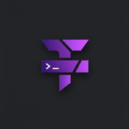
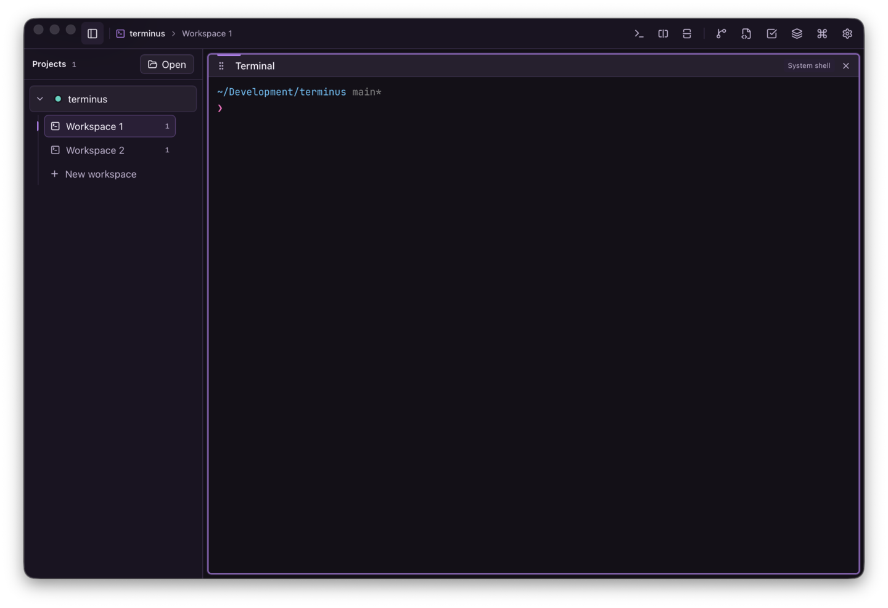
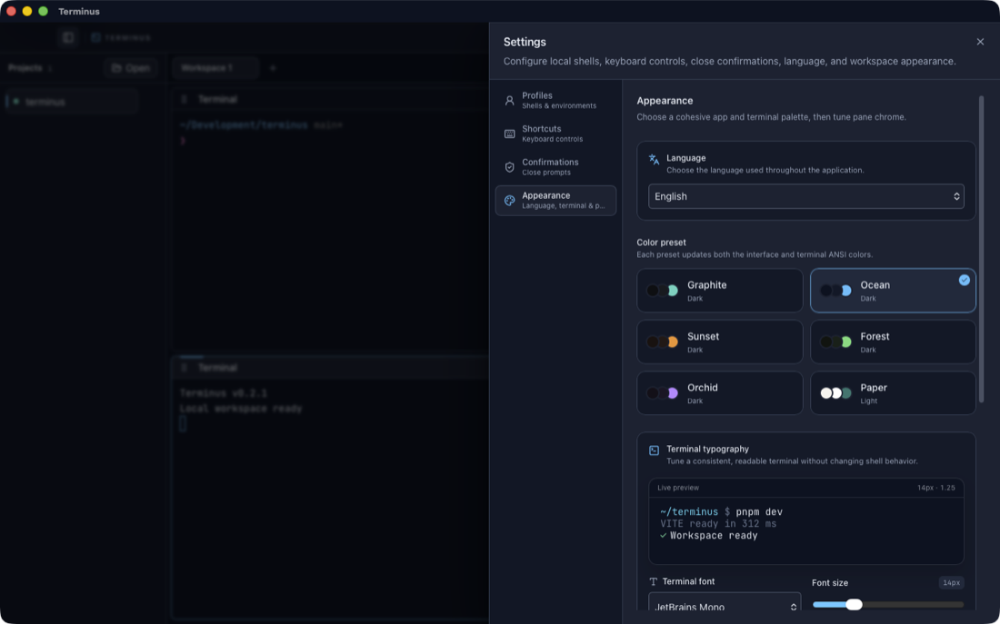
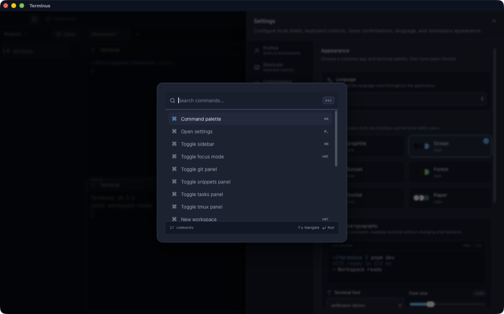
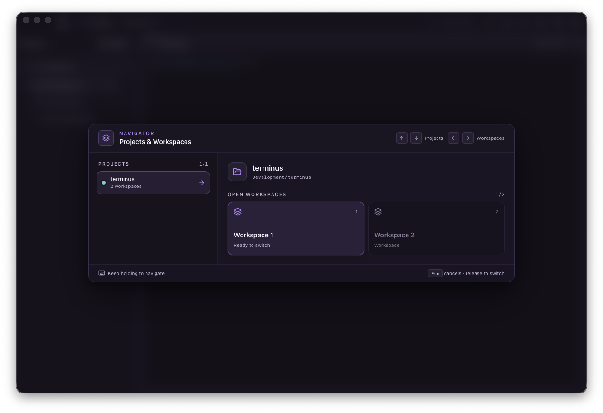
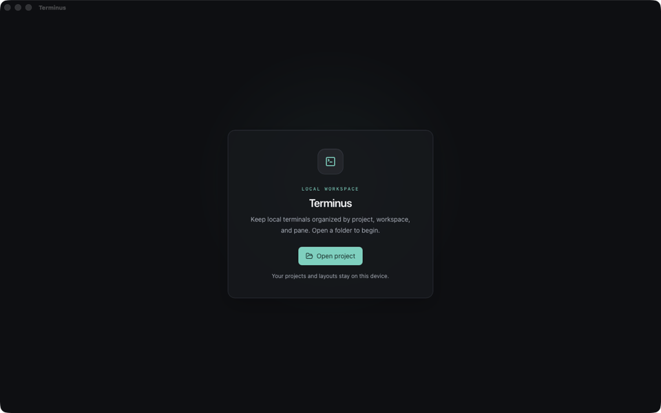

<div align="center">
  

  # Terminus

  **A local, multi-OS terminal workspace for projects, workspaces, and split panes.**

  Keep shells and lightweight project tools together without turning your
  terminal into an IDE.

  [](https://github.com/YasinKose/terminus/releases/latest)
  [](https://github.com/YasinKose/terminus/actions/workflows/verify-v02.yml)
  [](#downloads)

  [Download](#downloads) · [Features](#features) · [Build from source](#build-from-source) · [Roadmap](#project-status-and-roadmap)
</div>



## What is Terminus?

Terminus is a desktop workspace for local terminal sessions. Open a project
folder, create workspaces for different jobs, and arrange trusted local shells
in persistent split-pane layouts.

The v0.2 line adds a focused Git workbench, project-local tasks and snippets,
and an opt-in tmux bridge. Terminus deliberately remains a terminal-first tool:
it does not include SSH, AI chat, a plugin marketplace, an auto-updater, or a
general-purpose editor.

## Downloads

The latest release is **v0.2.2**. Choose the native package for your platform:

| Platform | Package | Download |
| --- | --- | --- |
| macOS — Apple Silicon | DMG | [Terminus_0.2.2_aarch64.dmg](https://github.com/YasinKose/terminus/releases/download/v0.2.2/Terminus_0.2.2_aarch64.dmg) |
| macOS — Intel | DMG | [Terminus_0.2.2_x64.dmg](https://github.com/YasinKose/terminus/releases/download/v0.2.2/Terminus_0.2.2_x64.dmg) |
| Windows — x64 | NSIS installer | [Terminus_0.2.2_x64-setup.exe](https://github.com/YasinKose/terminus/releases/download/v0.2.2/Terminus_0.2.2_x64-setup.exe) |
| Linux — x64 | AppImage | [Terminus_0.2.2_amd64.AppImage](https://github.com/YasinKose/terminus/releases/download/v0.2.2/Terminus_0.2.2_amd64.AppImage) |
| Ubuntu/Debian — x64 | DEB | [Terminus_0.2.2_amd64.deb](https://github.com/YasinKose/terminus/releases/download/v0.2.2/Terminus_0.2.2_amd64.deb) |

All packages are also available on the
[v0.2.2 release page](https://github.com/YasinKose/terminus/releases/tag/v0.2.2),
including compressed macOS `.app` bundles.

Windows releases use the NSIS `.exe` installer. MSI packaging is temporarily
disabled while its installation path is being hardened and independently
smoke-tested.

> [!IMPORTANT]
> Current packages are unsigned. macOS Gatekeeper, Windows SmartScreen, or
> your Linux desktop may display a warning on first launch. Code signing,
> notarization, and automatic updates are planned for a later release.

## Features

- **Project-first organization** — expand projects in the resizable sidebar
  and switch between their nested, persistent workspaces.
- **Unified workspace chrome** — see the active `Project › Workspace` path and
  reach terminal, split, Git, Tasks, Snippets, and tmux actions from one
  compact titlebar.
- **Hold-to-navigate switcher** — hold **Control + Option + Shift**, use
  up/down for projects and left/right for workspaces, then release to switch.
- **Split-pane terminal layouts** — split, resize, reorder, rename, and focus
  panes while keeping PTY output outside the application state store.
- **Automatic agent CLI titles** — recognize foreground Codex, Claude Code,
  and OpenCode sessions while preserving OSC titles and user-locked names.
- **Trusted shell profiles** — configure validated executables, ordered
  arguments, environment overrides, and working directories.
- **Lightweight Git workbench** — inspect status and diffs; stage, unstage,
  commit, switch or create local branches, and manage basic stashes.
- **Project-local tasks** — maintain a small board stored with the project.
- **Reusable snippets** — manage snippets, discover optional Makefile targets,
  and insert text into the focused terminal.
- **Optional tmux bridge** — detect, list, and attach to existing user tmux
  sessions without replacing the default local PTY workflow.
- **Keyboard-first control** — command palette, configurable shortcuts, focus
  mode, and workspace navigation.
- **Cohesive appearance** — six app-and-terminal color presets, terminal
  typography controls, pane chrome settings, and English/Turkish UI.

<table>
  <tr>
    <td width="50%">
      
    </td>
    <td width="50%">
      
    </td>
  </tr>
  <tr>
    <td align="center"><sub>App and terminal appearance</sub></td>
    <td align="center"><sub>Searchable command palette</sub></td>
  </tr>
</table>

<p align="center">
  
  <br>
  <sub>Hold Control + Option + Shift to preview projects and workspaces; release to switch.</sub>
</p>

## Getting started

1. Install the package for your operating system.
2. Launch Terminus and select **Open project**.
3. Choose a local folder. Terminus creates the first workspace and trusted
   system-shell pane.
4. Add terminals or splits from the titlebar, then open Git, Tasks, Snippets,
   or tmux from the same toolbar as needed.

<p align="center">
  
</p>

Projects, layout metadata, profiles, shortcuts, and settings are persisted in
Terminus' local SQLite database. Task and snippet data is project-local.
Restarting Terminus recreates local shells from the saved layout; it does not
revive local processes or scrollback. Use the optional tmux path when process
continuity is required.

## Build from source

### Prerequisites

- [Node.js 24](https://nodejs.org/) and
  [pnpm 11.9](https://pnpm.io/installation)
- The [Rust stable toolchain](https://rustup.rs/)
- The operating-system dependencies from the
  [Tauri v2 prerequisites guide](https://v2.tauri.app/start/prerequisites/)

### Run the desktop app

```bash
git clone https://github.com/YasinKose/terminus.git
cd terminus
pnpm install --frozen-lockfile
pnpm tauri:dev
```

Running `pnpm dev` starts only the Vite frontend. Use `pnpm tauri:dev` when
testing PTYs, persistence, native dialogs, or other Tauri integrations.

### Build a native package

```bash
pnpm tauri:build
```

Tauri produces the package formats supported by the host operating system.
Cross-platform release artifacts are built by the tag-triggered
[release workflow](.github/workflows/release.yml).

## Architecture

```text
React 19 + TypeScript + Zustand + xterm.js
                  │ typed Tauri commands/events
                  ▼
Tauri v2 + Rust
  ├─ portable-pty session manager
  ├─ SQLite persistence
  ├─ structured Git operations
  ├─ project-local tasks and snippets
  └─ optional tmux bridge
```

The React UI owns low-frequency interface state. Rust owns operating-system
side effects, PTY lifecycle, persistence, Git operations, and path validation.
High-frequency terminal output travels directly to the terminal runtime rather
than through Zustand.

Repository-level product boundaries and architecture invariants are maintained
in [AGENTS.md](AGENTS.md) and [CLAUDE.md](CLAUDE.md).

## Security model

- Shells are launched only through validated profiles; the frontend has no
  free-form shell executor.
- Git and tmux use structured Rust command paths.
- SQL is parameterized, and PTY/OSC content is treated as untrusted input.
- Source previews are read-only and restricted to project-scoped UTF-8 text
  files under 2 MiB.
- Tauri capabilities remain least-privilege; Terminus does not request broad
  filesystem access.

Please report a potential vulnerability privately to the repository owner
instead of opening a public issue with exploit details.

## Development and verification

Common commands:

| Command | Purpose |
| --- | --- |
| `pnpm check` | Type-check the React/TypeScript application |
| `pnpm test:run` | Run the Vitest suite once |
| `cargo test --manifest-path src-tauri/Cargo.toml` | Run Rust unit and integration tests |
| `pnpm build` | Type-check and build the production frontend |
| `pnpm verify:v02` | Run the complete v0.2 verification gate |
| `pnpm audit:rust` | Audit Rust dependencies under the documented policy |
| `make ci` | Run verification, audits, Clippy, and a package-free Tauri build |

The
[Verify v0.2 workflow](.github/workflows/verify-v02.yml) runs frontend checks,
tests, Rust tests, and a package-free desktop build on macOS, Ubuntu, and
Windows. Native release packages remain unsigned and should receive packaged
human smoke testing on each supported operating system.

## Project status and roadmap

Terminus is under active development. v0.2 focuses on multi-OS local terminal
workflows and light project tools. SSH/remote access, signing/notarization,
automatic updates, additional distribution channels, and any optional AI or
plugin surface belong to separately designed v0.3+ work.

See [AGENTS.md](AGENTS.md), [CLAUDE.md](CLAUDE.md), and the
[changelog](CHANGELOG.md) for the current boundaries and release history.

## Contributing

Issues and focused pull requests are welcome. Before proposing a change:

1. Read [AGENTS.md](AGENTS.md) and [CLAUDE.md](CLAUDE.md).
2. Do not reintroduce tracked `docs/` or `legacy/` trees.
3. Preserve the PTY, security, persistence, and typed-command invariants.
4. Run `pnpm verify:v02` and `pnpm audit:rust`.
5. Use Conventional Commit prefixes such as `feat:`, `fix:`, `docs:`, or
   `test:`.

Open an [issue](https://github.com/YasinKose/terminus/issues) before beginning
large product or architecture changes.

## License

No open-source license is currently declared for this repository. Source
availability does not grant permission to copy, modify, or redistribute the
project beyond the rights provided by applicable law and GitHub's terms.
