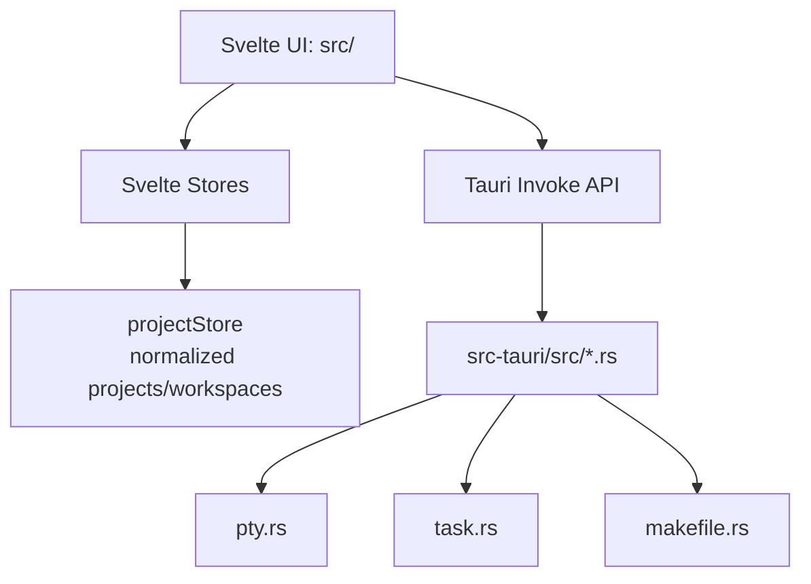

# Codebase Summary (Terminus)

Generated on: 2026-02-07
Updated after: workspace/terminal stability revision

## Scope
This summary reflects current repository structure, active runtime architecture, and latest workspace/terminal lifecycle behavior.

## Architecture Snapshot

## Project Layout
- `src/`: active Svelte + TypeScript app (components, stores, utils, types).
- `src-tauri/src/`: Rust backend commands wired in `src-tauri/src/lib.rs`.
- `docs/`: roadmap, PRD, phased notes, design plans, implementation plans.
- `src/main`, `src/renderer`, `src/shared`: legacy Electron prototype code.

## Technology Stack
- Frontend: Svelte 5, TypeScript, Vite, TailwindCSS, xterm.
- Desktop runtime: Tauri 2 (Rust, portable-pty).
- Tooling: `svelte-check`, `tsc`, `cargo check`, Makefile wrappers.

## Recent Architectural Changes
- Workspace model normalized into global `workspaces[]` with strict `projectId` ownership.
- Project<->workspace activation synchronized both ways.
- Workspace views remain mounted and toggle visibility to preserve terminal renderer state.
- Split close behavior stabilized by keeping keyed child identity and avoiding single-child split collapse.
- PTY spawn is idempotent by terminal id; PTY is not closed on terminal component unmount.

## Health Check Results
Commands executed:
- `npm run check`
- `cd src-tauri && cargo check`

Results:
- `npm run check`: failed (existing snippet + legacy Electron TS issues remain).
- `cargo check`: passed.

Top TypeScript errors currently reported:
- `src/lib/components/SnippetList.svelte`: null/undefined and payload type mismatch.
- `src/main/*` legacy Electron files: missing `electron`/node type context and type-only import issues.

## Recommendations
1. Isolate or retire legacy Electron directories from active TS checks.
2. Resolve snippet type contracts in `SnippetList.svelte` and form payload path.
3. Add targeted tests for `projectStore` pane-tree mutation invariants and workspace lifecycle.
