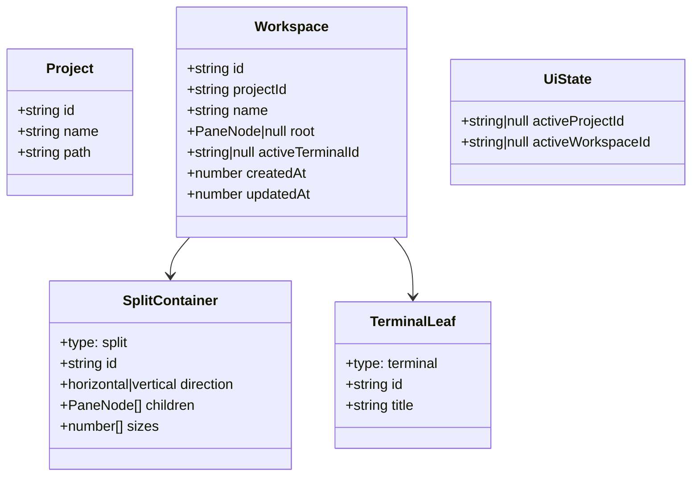

# Data Models

## Core Type Models

## Store Persistence Models
- Normalized localStorage keys:
  - `terminus_projects_v2`
  - `terminus_workspaces_v2`
  - `terminus_active_project_v2`
  - `terminus_active_workspace_v2`
- Legacy compatibility:
  - Migrates `terminus_projects` and `terminus_active_project` to v2 on startup.

## Snippet Models
- `Snippet`: `id`, `name`, `command`, optional `description`, `category`, `isFavorite`, `scope`, optional `projectId`, timestamps.
- `SnippetCategory`: `id`, `name`, `icon`.
- `SnippetFormData`: input form payload for create/update.

## Task Board Models
- `Board`: `columns: Column[]`
- `Column`: `id`, `title`, `tasks: Task[]`
- `Task`: `id`, `title`, optional `description`

## Migration Models
- `LegacyProject` + `LegacyTerminalTab` are migrated into normalized v2 state.
- `ProjectV1` (embedded workspace schema) is flattened into global `Workspace[]` with `projectId` ownership.
