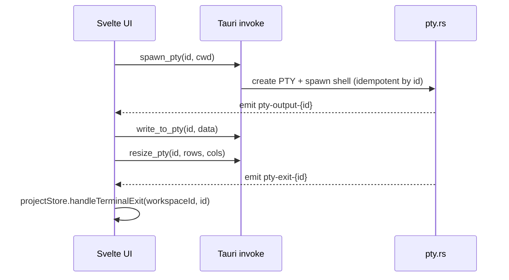
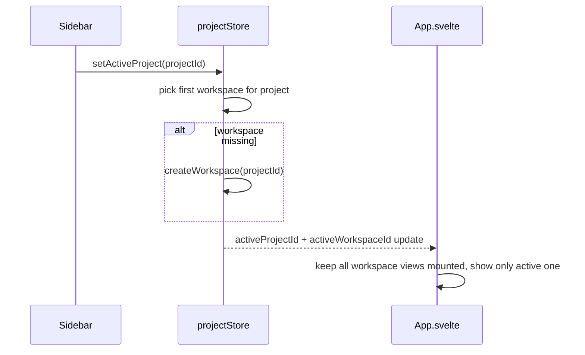
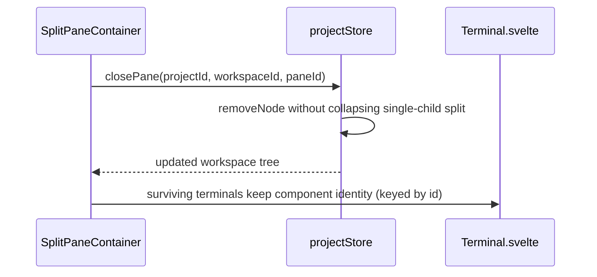
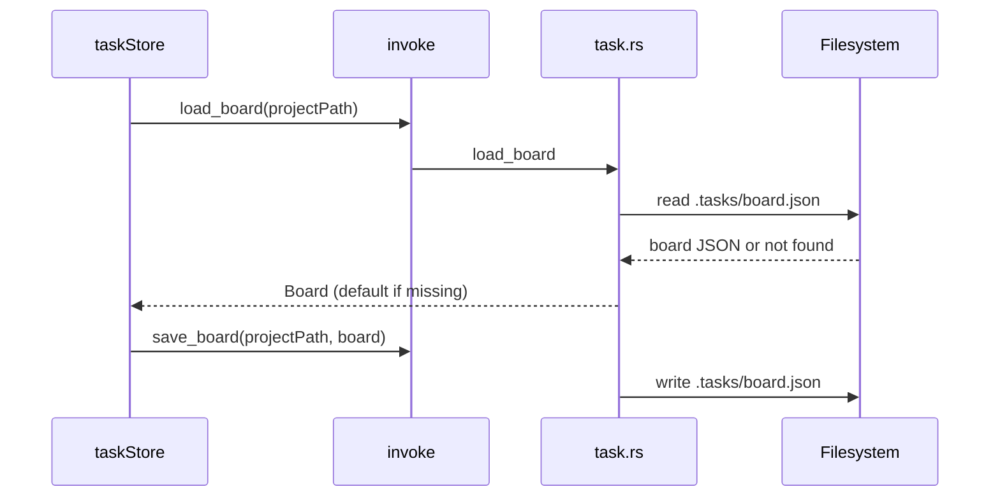
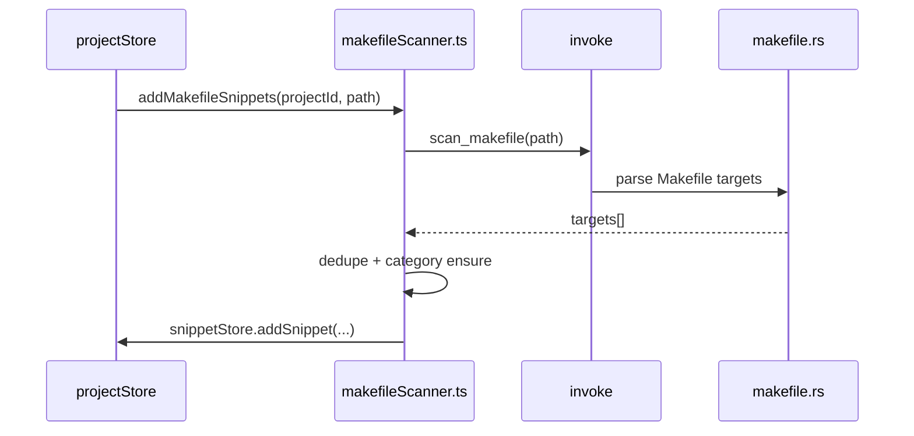

# Workflows

## Terminal Spawn and Streaming

```mermaid
sequenceDiagram
  participant UI as Svelte UI
  participant API as Tauri invoke
  participant PTY as pty.rs
  UI->>API: spawn_pty(id, cwd)
  API->>PTY: create PTY + spawn shell (idempotent by id)
  PTY-->>UI: emit pty-output-{id}
  UI->>API: write_to_pty(id, data)
  UI->>API: resize_pty(id, rows, cols)
  PTY-->>UI: emit pty-exit-{id}
  UI->>UI: projectStore.handleTerminalExit(workspaceId, id)
```

## Project and Workspace Navigation

```mermaid
sequenceDiagram
  participant SIDEBAR as Sidebar
  participant STORE as projectStore
  participant APP as App.svelte
  SIDEBAR->>STORE: setActiveProject(projectId)
  STORE->>STORE: pick first workspace for project
  alt workspace missing
    STORE->>STORE: createWorkspace(projectId)
  end
  STORE-->>APP: activeProjectId + activeWorkspaceId update
  APP->>APP: keep all workspace views mounted, show only active one
```

## Split Close Stability (TUI-safe)

```mermaid
sequenceDiagram
  participant UI as SplitPaneContainer
  participant STORE as projectStore
  participant TERM as Terminal.svelte
  UI->>STORE: closePane(projectId, workspaceId, paneId)
  STORE->>STORE: removeNode without collapsing single-child split
  STORE-->>UI: updated workspace tree
  UI->>TERM: surviving terminals keep component identity (keyed by id)
```

## Task Board Persistence

```mermaid
sequenceDiagram
  participant UI as taskStore
  participant API as invoke
  participant TASK as task.rs
  participant FS as Filesystem
  UI->>API: load_board(projectPath)
  API->>TASK: load_board
  TASK->>FS: read .tasks/board.json
  FS-->>TASK: board JSON or not found
  TASK-->>UI: Board (default if missing)
  UI->>API: save_board(projectPath, board)
  TASK->>FS: write .tasks/board.json
```

## Makefile Snippet Import

```mermaid
sequenceDiagram
  participant STORE as projectStore
  participant UTIL as makefileScanner.ts
  participant API as invoke
  participant MK as makefile.rs
  STORE->>UTIL: addMakefileSnippets(projectId, path)
  UTIL->>API: scan_makefile(path)
  API->>MK: parse Makefile targets
  MK-->>UTIL: targets[]
  UTIL->>UTIL: dedupe + category ensure
  UTIL->>STORE: snippetStore.addSnippet(...)
```
